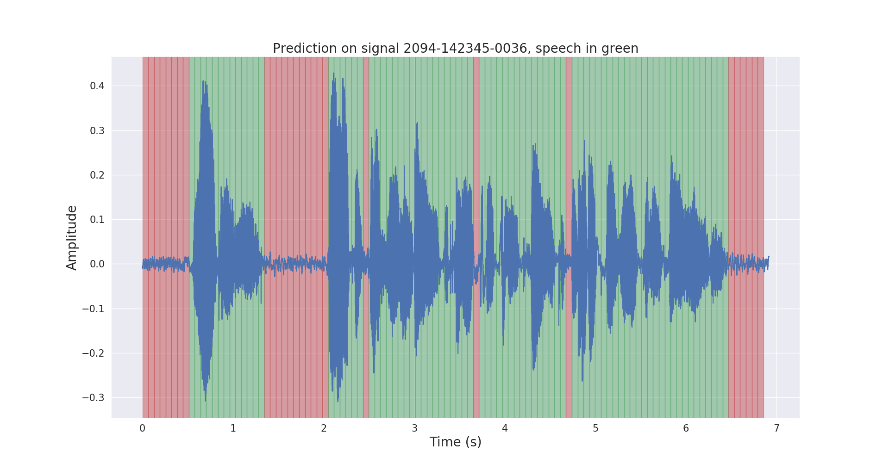
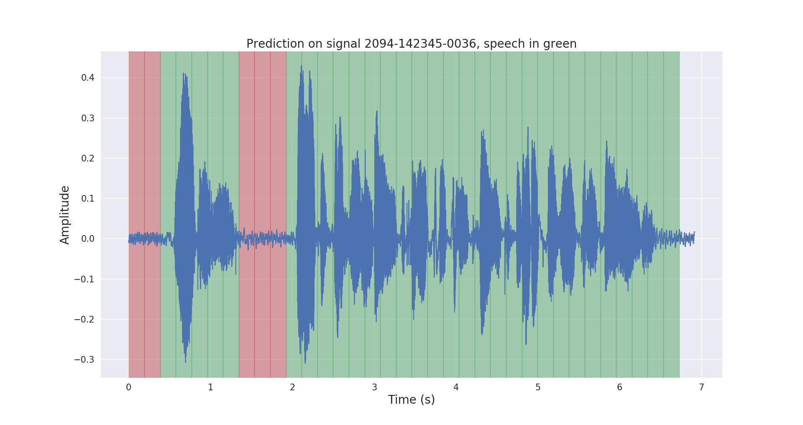

# Voice Activity Detection project


Keywords: Python, TensorFlow, Deep Learning, 
Time Series classification

## Table of contents

1. [ Installation ](#1-installation)  
    1.1 [ Basic installation ](#11-basic-installation)  
    1.2 [ Virtual environment installation ](#12-virtual-environment-installation)  
    1.3 [ Docker installation ](#13-docker-installation)
2. [ Introduction ](#2-introduction)  
    2.1 [ Goal ](#21-goal)  
    2.2 [ Results ](#22-results)  
3. [ Project structure ](#3-project-structure)
4. [ Dataset ](#4-dataset)
5. [ Project usage ](#5-project-usage)  
    5.1 [ Dataset automatic labeling ](#51-dataset-automatic-labeling)  
    5.2 [ Record raw data to .tfrecord format ](#52-record-raw-data-to-tfrecord-format)  
    5.3 [ Train a CNN to classify Speech & Noise signals ](#53-train-a-cnn-to-classify-speech--noise-signals)  
    5.4 [ Export trained model & run inference on Test set ](#54-export-trained-model--run-inference-on-test-set)  
6. [ Todo ](#6-todo)
7. [ Resources ](#7-resources)

## 1. Installation

This project was designed for:
* Ubuntu 20.04
* Python 3.7.3
* TensorFlow 1.15.4

```bash
$ cd /path/to/project/
$ git clone https://github.com/filippogiruzzi/voice_activity_detection.git
$ cd voice_activity_detection/
```

### 1.1 Basic installation

:warning: It is recommended to use virtual environments !

```bash
$ pyenv install 3.7.3
$ pyenv virtualenv 3.7.3 vad-venv
$ pyenv activate vad-venv
```

```bash
$ pip install -r requirements.txt
$ pip install -e .
```

## 1.2 Virtual environment installation

## 1.3 Docker installation

You can pull the latest image from DockerHub and run Python commands inside the container:
```bash
$ docker pull filippogrz/tf-vad:latest
$ docker run --rm --gpus all -v /var/run/docker.sock:/var/run/docker.sock -it --entrypoint /bin/bash -e TF_FORCE_GPU_ALLOW_GROWTH=true filippogrz/tf-vad
```

If you want to build the docker image and run the container from scratch, run the following commands.

Build the docker image:
```bash
$ make build
```
(This might take a while.)

Run the docker image:
```bash
$ make local-nobuild
```

## 2. Introduction

### 2.1 Goal

The purpose of this project is to design and implement 
a real-time Voice Activity Detection algorithm based on Deep Learning.

The designed solution is based on MFCC feature extraction and 
a 1D-Resnet model that classifies whether a audio signal is 
speech or noise.

### 2.2 Results

| Model | Train acc. | Val acc. | Test acc. |
| :---: |:---:| :---:| :---: |
| 1D-Resnet | 99 % | 98 % | 97 % |

Raw and post-processed inference results on a test audio signal are shown below.




## 3. Project structure

The project `voice_activity_detection/` has the following structure:
* `vad/data_processing/`: raw data labeling, processing, 
recording & visualization
* `vad/training/`: data, input pipeline, model 
& training / evaluation / prediction
* `vad/inference/`: exporting trained model & inference

## 4. Dataset

Please download the LibriSpeech ASR corpus dataset from https://openslr.org/12/, 
and extract all files to : `/path/to/LibriSpeech/`.

The dataset contains approximately 1000 hours of 16kHz read English speech 
from audiobooks, and is well suited for Voice Activity Detection.

I automatically annotated the `test-clean` set of the dataset with a 
pretrained VAD model.

Please feel free to use the `labels/` folder and the pre-trained VAD model (only for inference) from this 
[ link ](https://drive.google.com/open?id=1ZPQ6wnMhHeE7XP5dqpAEmBAryFzESlin).

## 5. Project usage

```bash
$ cd /path/to/project/voice_activity_detection/vad/
```

### 5.1 Dataset automatic labeling

Skip this subsection if you already have the `labels/` folder, that contains annotations 
from a different pre-trained model.

```bash
$ python data_processing/librispeech_label_data.py --data_dir /path/to/LibriSpeech/test-clean/ --exported_model /path/to/pretrained/model/ --out_dir /path/to/LibriSpeech/labels/
```

This will record the annotations into `/path/to/LibriSpeech/labels/` as 
`.json` files.

### 5.2 Record raw data to .tfrecord format

```bash
$ python data_processing/data_to_tfrecords.py --data_dir /path/to/LibriSpeech/
```

This will record the splitted data to `.tfrecord` format in `/path/to/LibriSpeech/tfrecords/`

### 5.3 Train a CNN to classify Speech & Noise signals

```bash
$ python training/train.py --data-dir /path/to/LibriSpeech/tfrecords/
```

### 5.4 Export trained model & run inference on Test set

```bash
$ python inference/export_model.py --model-dir /path/to/trained/model/dir/ --ckpt /path/to/trained/model/dir/
$ python inference/inference.py --data_dir /path/to/LibriSpeech/ --exported_model /path/to/exported/model/ --smoothing
```

The trained model will be recorded in `/path/to/LibriSpeech/tfrecords/models/resnet1d/`. 
The exported model will be recorded inside this directory.

## 6. Todo

- [ ] Compare Deep Learning model to a simple baseline
- [ ] Train on full dataset
- [ ] Improve data balancing
- [ ] Add time series data augmentation
- [ ] Study ROC curve & classification threshold
- [ ] Add online inference
- [ ] Evaluate quantitatively post-processing methods on the Test set
- [ ] Add model description & training graphs
- [ ] Add Google Colab demo

## 7. Resources

* _Voice Activity Detection for Voice User Interface_, 
[Medium](https://medium.com/linagoralabs/voice-activity-detection-for-voice-user-interface-2d4bb5600ee3)
* _Deep learning for time series classifcation: a review_,
Fawaz et al., 2018, [Arxiv](https://arxiv.org/abs/1809.04356)
* _Time Series Classification from Scratch 
with Deep Neural Networks: A Strong Baseline_, Wang et al., 2016,
[Arxiv](https://arxiv.org/abs/1611.06455)
