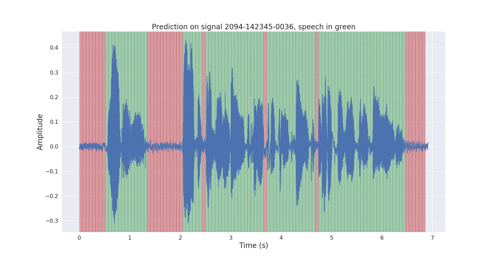
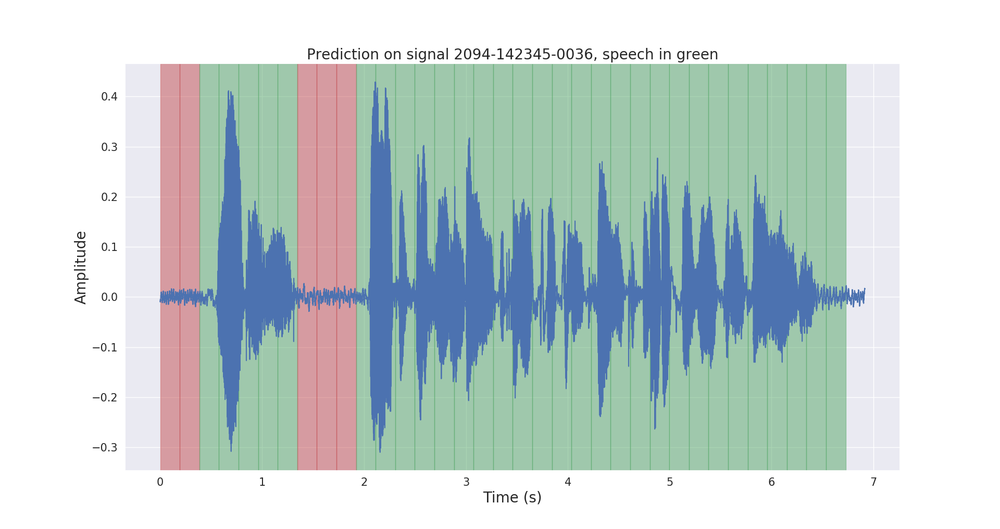

# Voice Activity Detection project

<p align="center">
    <a href="https://github.com/filippogiruzzi/voice_activity_detection/actions/workflows/ci.yml" alt="CI">
        </a>
    <a href="https://github.com/filippogiruzzi/voice_activity_detection/actions/workflows/cd.yml" alt="CD">
        </a>
</p>
<p align="center">
    <a href="https://github.com/filippogiruzzi/voice_activity_detection"></a>
    <a href="https://github.com/filippogiruzzi/voice_activity_detection"></a>
    <a href="https://hub.docker.com/repository/docker/filippogrz/vad"></a>
</p>

<center>Keywords: Python, PyTorch, Deep Learning, Audio, Time Series classification, uv, Docker</center>

## Table of contents

1. [ Installation ](#1-installation)
2. [ Introduction ](#2-introduction)
3. [ Project structure ](#3-project-structure)
4. [ Dataset ](#4-dataset)
5. [ Project usage ](#5-project-usage)
6. [ Testing ](#6-testing)
7. [ Continuous integration & delivery ](#7-continuous-integration--delivery)
8. [ Contributing ](#8-contributing)
9. [ Todo ](#9-todo)
10. [ License ](#10-license)
11. [ Resources ](#11-resources)

## 1. Installation

This project uses:
* Python 3.11+
* PyTorch 2.2+
* [uv](https://docs.astral.sh/uv/) package manager

```bash
git clone https://github.com/filippogiruzzi/voice_activity_detection.git
cd voice_activity_detection/
```

### 1.1 Install with uv (recommended)

```bash
# Install uv if you don't have it
curl -LsSf https://astral.sh/uv/install.sh | sh

# Install all dependencies
uv sync
```

### 1.2 Development setup

```bash
# Install with dev dependencies (ruff, pytest, etc.)
uv sync

# Run linters
make lint

# Run tests
make test

# Auto-format code
make format
```

### 1.3 Docker installation

Build and run the CPU Docker image:
```bash
make build
make local-nobuild
```

For GPU support (requires NVIDIA Docker runtime):
```bash
make build-gpu
```

## 2. Introduction

### 2.1 Goal

The purpose of this project is to design and implement a real-time Voice Activity Detection algorithm based on Deep Learning.

The designed solution is based on a simple pipeline with MFCC feature extraction and a small 1D-ResNet model (PyTorch) that classifies whether an audio signal is speech or noise.

### 2.2 Results

| Model | Train acc. | Val acc. | Test acc. |
| :---: |:---:| :---:| :---: |
| 1D-Resnet | 99 % | 98 % | 97 % |

Raw and post-processed inference results on a test audio signal are shown below.




### 2.3 Model & features

Each audio window of `SEQ_LEN = 1024` samples (16 kHz) is converted into a
**16 × 65** feature tensor stacking:

* 5 MFCC coefficients,
* 5 MFCC deltas (1st order),
* 5 MFCC delta-deltas (2nd order),
* 1 RMS energy.

These features feed a configurable 1D-ResNet (`vad.model.Resnet1D`):
stacked residual blocks (3 × `Conv1d → BatchNorm1d` with a 1×1 shortcut) →
global average pooling → a fully connected head producing a single speech logit.
The architecture is fully described by the `ModelConfig` dataclass, so the same
configuration must be used at training, export, and inference time.

## 3. Project structure

The core code lives flat inside `vad/`:
* `vad/model.py`: the `Resnet1D` model architecture and its `ModelConfig` dataclass
* `vad/data.py`: feature extraction, dataset building & the PyTorch DataLoader
* `vad/train.py`: training loop & model export (state dict + TorchScript)
* `vad/inference.py`: sliding-window inference & visualization

Supporting files:
* `tests/`: pytest integration tests (training → export → inference)
* `scripts/`: Docker build / run helpers
* `Makefile`: common developer commands (`install`, `lint`, `format`, `test`, `build`, ...)
* `pyproject.toml`: project metadata, dependencies & tooling configuration

## 4. Dataset

Please download the LibriSpeech ASR corpus dataset from https://openslr.org/12/,
and extract all files to: `/path/to/LibriSpeech/`.

The dataset contains approximately 1000 hours of 16kHz read English speech
from audiobooks, and is well suited for Voice Activity Detection.

I automatically annotated the `test-clean` set of the dataset with a
pretrained VAD model.

Please feel free to use the `labels/` folder and the pre-trained VAD model (only for inference) from this
[ link ](https://drive.google.com/open?id=1ZPQ6wnMhHeE7XP5dqpAEmBAryFzESlin).

**Important note:** As this is only a toy project, it is designed to split the `test-clean` sub-dataset intro train / val / test for quick iteration, but can be extended to a full large-scale dataset.

## 5. Project usage

### 5.1 Create PyTorch dataset from raw audio

```bash
uv run vad-data --data-dir /path/to/LibriSpeech/
```

This saves processed `.pt` files to `/path/to/LibriSpeech/dataset/{train,val,test}/`.
Use `--max-files N` to process only a few files per split for a quick run.

### 5.2 Train & export the VAD model

```bash
uv run vad-train --data-dir /path/to/LibriSpeech/dataset/ --model-dir /path/to/models/
```

Checkpoints are saved to `--model-dir`, and the final model is exported (state dict +
TorchScript) to `<model-dir>/exported/` unless `--no-export` is passed.

Useful flags: `--epochs/-e`, `--batch-size/-b`, `--lr`, and the architecture flags
`--n-filters` / `--fc-units`. Training device (CUDA, Apple MPS, or CPU) is selected
automatically. TensorBoard logs are written to `<model-dir>/logs/`:

```bash
uv run tensorboard --logdir /path/to/models/logs/
```

### 5.3 Run inference

```bash
uv run vad-inference \
    --data-dir /path/to/LibriSpeech/ \
    --checkpoint /path/to/models/exported/model_state_dict.pt \
    --smoothing --max-files 1
```

> **Note:** if you trained with custom `--n-filters` / `--fc-units`, pass the same
> values to `vad-inference` so the checkpoint loads into a matching architecture.

## 6. Testing

Run the test suite with coverage:

```bash
make test
```

This runs `pytest` with coverage over the `vad` package, printing a
term report with missing lines and writing an HTML report to `htmlcov/`.

## 7. Continuous integration & delivery

* **CI** ([`.github/workflows/ci.yml`](.github/workflows/ci.yml)): on every push and
  pull request, runs `ruff` lint, `ruff format --check`, and the pytest suite.
* **CD** ([`.github/workflows/cd.yml`](.github/workflows/cd.yml)): on push to
  `master`/`main`, builds the Docker image and pushes it to Docker Hub
  (tagged with the commit SHA and `latest`).

## 8. Contributing

Contributions are welcome! Please:

1. Fork the repository and create a feature branch.
2. Install the dev environment with `uv sync`.
3. Make sure `make lint` and `make test` pass before opening a pull request.
4. Use clear commit messages and keep changes focused.

## 9. Todo

### 9.1 ML Engineering

- [ ] Add MLflow experiment tracking (params, metrics, artifacts)
- [ ] Reach full unit-test coverage and add CI coverage reporting
- [ ] Add online / streaming real-time inference
- [ ] Serve the model via a REST/gRPC API (e.g. FastAPI + ONNX Runtime)
- [ ] Add data/version control (DVC) and a model registry

### 9.2 Data Science

- [ ] Compare the model against a simple baseline and train on the full dataset
- [ ] Add time-series data augmentation and improve class balancing
- [ ] Study the ROC curve & tune the classification threshold
- [ ] Explore self-supervised speech encoders (e.g. WavLM, wav2vec 2.0)
- [ ] Benchmark modern lightweight VAD models (e.g. Silero VAD, Pyannote 3.x)


## 10. License

This project is licensed under the terms of the [GNU GPL v3](LICENSE).

## 11. Resources

* _Voice Activity Detection for Voice User Interface_,
[Medium](https://medium.com/linagoralabs/voice-activity-detection-for-voice-user-interface-2d4bb5600ee3)
* _Deep learning for time series classifcation: a review_,
Fawaz et al., 2018, [Arxiv](https://arxiv.org/abs/1809.04356)
* _Time Series Classification from Scratch
with Deep Neural Networks: A Strong Baseline_, Wang et al., 2016,
[Arxiv](https://arxiv.org/abs/1611.06455)
